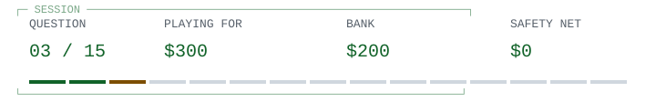

# Ada Lovelace / read the actual notes

> 
>
> **<samp>Lovelace&#39;s Note G ends with a detailed table of operations for the proposed Analytical Engine. What does that example compute?</samp>**

<table width="100%">
<tr>
<td width="50%"><a href="q04.md"> <samp>Bernoulli numbers</samp></a></td>
<td width="50%"><a href="game-over-0.md"> <samp>Prime numbers</samp></a></td>
</tr>
<tr>
<td width="50%"><a href="game-over-0.md"> <samp>Logarithms</samp></a></td>
<td width="50%"><a href="game-over-0.md"> <samp>Trigonometric tables</samp></a></td>
</tr>
</table>

<table width="100%">
<tr>
<td width="33%" valign="top">

<samp>A and C</samp>

</td>
<td width="34%" valign="top">

<samp>The note names a family of numbers used in mathematical analysis, not a list of primes.</samp>

</td>
<td width="33%" valign="top">

<samp>$200 / 2 of 15 answered.</samp>

<a href="../../README.md">Games</a> / <a href="q01.md">Restart</a>

</td>
</tr>
</table>

Previous answer

## Q2: D / 1957

IBM's Fortran history dates its commercial release to 1957. It separately describes a 1953 budget and work in 1954: those are different milestones, not competing release dates. Generating efficient machine code mattered because programmers doubted a high-level language could compete with hand-written code. Source: IBM's institutional retrospective, 'Fortran'.

[Source](https://www.ibm.com/history/fortran)

<samp>[+] Prize ladder</samp>

| Round | Prize | Status |
| :--- | ---: | :--- |
| 15 | $1,000,000 | Next |
| 14 | $500,000 | Next |
| 13 | $250,000 | Next |
| 12 | $125,000 | Next |
| 11 | $64,000 | Next |
| 10 | $32,000 | Next / Safety net |
| 9 | $16,000 | Next |
| 8 | $8,000 | Next |
| 7 | $4,000 | Next |
| 6 | $2,000 | Next |
| 5 | $1,000 | Next / Safety net |
| 4 | $500 | Next |
| 3 | $300 | Current |
| 2 | $200 | Answered |
| 1 | $100 | Answered |

<samp>[+] Answer & source (spoiler)</samp>

## A / Bernoulli numbers

Note G explicitly introduces a worked computation of Bernoulli numbers and supplies a table tracking the engine's operations and variables. This is a description for a proposed machine, not a report of the program running. The narrower claim is directly checkable without settling the contested label 'first programmer'. Source: Lovelace's translator's notes to Menabrea's Sketch of the Analytical Engine, Note G, transcribed by Fourmilab.

[Source](https://www.fourmilab.ch/babbage/sketch.html)

---

[Games](../../README.md) / [Restart](q01.md)
