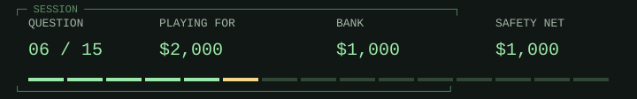

# Go / whiteboard to open source

**Safety net secured: $1,000**

> 
>
> **<samp>Go&#39;s design discussions began on September 21, 2007. When did the project become publicly available as open source?</samp>**

<table width="100%">
<tr>
<td width="50%"><a href="game-over-1000.md"> <samp>September 21, 2014</samp></a></td>
<td width="50%"><a href="q07.md"> <samp>November 10, 2009</samp></a></td>
</tr>
<tr>
<td width="50%"><a href="game-over-1000.md"> <samp>January 1, 2019</samp></a></td>
<td width="50%"><a href="game-over-1000.md"> <samp>September 21, 2024</samp></a></td>
</tr>
</table>

<table width="100%">
<tr>
<td width="33%" valign="top">

<samp>B and D</samp>

</td>
<td width="34%" valign="top">

<samp>The public release came about two years after the first whiteboard discussion.</samp>

</td>
<td width="33%" valign="top">

<samp>$1,000 / 5 of 15 answered.</samp>

<a href="../../README.md">Games</a> / <a href="q01.md">Restart</a>

</td>
</tr>
</table>

Previous answer

## Q5: A / Christmas 1989 / February 1991

Van Rossum began during the Christmas holidays in 1989 and posted Python to USENET in February 1991. Calling either year simply 'Python's creation date' loses information. He wanted an extensible scripting language that could reach Amoeba operating-system calls, rather than being limited to shell commands. Source: Python General FAQ, 'Why was Python created in the first place?'.

[Source](https://docs.python.org/3/faq/general.html#why-was-python-created-in-the-first-place)

<samp>[+] Prize ladder</samp>

| Round | Prize | Status |
| :--- | ---: | :--- |
| 15 | $1,000,000 | Next |
| 14 | $500,000 | Next |
| 13 | $250,000 | Next |
| 12 | $125,000 | Next |
| 11 | $64,000 | Next |
| 10 | $32,000 | Next / Safety net |
| 9 | $16,000 | Next |
| 8 | $8,000 | Next |
| 7 | $4,000 | Next |
| 6 | $2,000 | Current |
| 5 | $1,000 | Answered / Safety net |
| 4 | $500 | Answered |
| 3 | $300 | Answered |
| 2 | $200 | Answered |
| 1 | $100 | Answered |

<samp>[+] Answer & source (spoiler)</samp>

## B / November 10, 2009

The Go FAQ distinguishes September 21, 2007, when Robert Griesemer, Rob Pike, and Ken Thompson began sketching goals, from the November 10, 2009 public open-source release. A project start is not a public release, and neither label means version 1.0. Source: Go FAQ, 'What is the history of the project?'.

[Source](https://go.dev/doc/faq)

---

[Games](../../README.md) / [Restart](q01.md)
