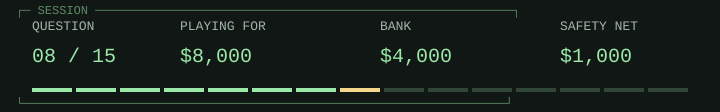

# Lisp / before the famous paper

<picture><source media="(prefers-color-scheme: dark)" srcset="hud/q08-dark.svg"><source media="(prefers-color-scheme: light)" srcset="hud/q08.svg"></picture>

> <picture><source media="(prefers-color-scheme: dark)" srcset="../../assets/trivia-question-dark.svg"><source media="(prefers-color-scheme: light)" srcset="../../assets/trivia-question.svg"></picture>
>
> **<samp>McCarthy&#39;s Recursive Functions paper appeared in April 1960. According to his later history, when did the implementation of Lisp begin?</samp>**

<table width="100%">
<tr>
<td width="50%"><a href="game-over-1000.md"><picture><source media="(prefers-color-scheme: dark)" srcset="../../assets/trivia-a-dark.svg"><source media="(prefers-color-scheme: light)" srcset="../../assets/trivia-a.svg"></picture> <samp>Fall 1948</samp></a></td>
<td width="50%"><a href="game-over-1000.md"><picture><source media="(prefers-color-scheme: dark)" srcset="../../assets/trivia-b-dark.svg"><source media="(prefers-color-scheme: light)" srcset="../../assets/trivia-b.svg"></picture> <samp>Fall 1968</samp></a></td>
</tr>
<tr>
<td width="50%"><a href="q09.md"><picture><source media="(prefers-color-scheme: dark)" srcset="../../assets/trivia-c-dark.svg"><source media="(prefers-color-scheme: light)" srcset="../../assets/trivia-c.svg"></picture> <samp>Fall 1958</samp></a></td>
<td width="50%"><a href="game-over-1000.md"><picture><source media="(prefers-color-scheme: dark)" srcset="../../assets/trivia-d-dark.svg"><source media="(prefers-color-scheme: light)" srcset="../../assets/trivia-d.svg"></picture> <samp>Fall 1978</samp></a></td>
</tr>
</table>

<table width="100%">
<tr>
<td width="33%" valign="top">

<picture><source media="(prefers-color-scheme: dark)" srcset="../../assets/trivia-fifty-dark.svg"><source media="(prefers-color-scheme: light)" srcset="../../assets/trivia-fifty.svg"></picture>

<samp>A and C</samp>

</td>
<td width="34%" valign="top">

<picture><source media="(prefers-color-scheme: dark)" srcset="../../assets/trivia-hint-dark.svg"><source media="(prefers-color-scheme: light)" srcset="../../assets/trivia-hint.svg"></picture>

<samp>The implementation was already underway before the paper appeared.</samp>

</td>
<td width="33%" valign="top">

<picture><source media="(prefers-color-scheme: dark)" srcset="../../assets/trivia-cash-dark.svg"><source media="(prefers-color-scheme: light)" srcset="../../assets/trivia-cash.svg"></picture>

<samp>$4,000 / 7 of 15 answered.</samp>

<a href="../../README.md">Games</a> / <a href="q01.md">Restart</a>

</td>
</tr>
</table>

Previous answer

## Q7: D / BCPL, then B, then C

Ritchie traces C through Thompson's B to Richards's BCPL. His 1993 history says C came into being during 1969-1973, with its most creative period in 1972; its acknowledgments more specifically date the transformation of B into C to 1971-1973. A tidy family tree is useful, but language design still happens over a span of time. Source: Dennis M. Ritchie, The Development of the C Language, HOPL-II, 1993.

[Source](https://www.nokia.com/bell-labs/about/dennis-m-ritchie/chist.html)

<samp>[+] Prize ladder</samp>

| Round | Prize | Status |
| :--- | ---: | :--- |
| 15 | $1,000,000 | Next |
| 14 | $500,000 | Next |
| 13 | $250,000 | Next |
| 12 | $125,000 | Next |
| 11 | $64,000 | Next |
| 10 | $32,000 | Next / Safety net |
| 9 | $16,000 | Next |
| 8 | $8,000 | Current |
| 7 | $4,000 | Answered |
| 6 | $2,000 | Answered |
| 5 | $1,000 | Answered / Safety net |
| 4 | $500 | Answered |
| 3 | $300 | Answered |
| 2 | $200 | Answered |
| 1 | $100 | Answered |

<samp>[+] Answer & source (spoiler)</samp>

## C / Fall 1958

McCarthy's history says implementation began in fall 1958 at MIT. The April 1960 paper is a publication milestone, not the start of implementation. His history also distinguishes an earlier period of idea development and cautions that its recollections and attribution are incomplete. Source: John McCarthy, History of Lisp, 'The implementation of LISP', a 1979 draft hosted at Stanford.

[Source](https://www-formal.stanford.edu/jmc/history/lisp/node3.html)

---

[Games](../../README.md) / [Restart](q01.md)
