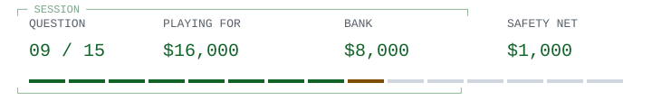

# Unix / the rewrite

> 
>
> **<samp>Early Unix was written in assembly language. Ritchie dates the kernel&#39;s rewrite in C to which period?</samp>**

<table width="100%">
<tr>
<td width="50%"><a href="game-over-1000.md"> <samp>Summer 1953</samp></a></td>
<td width="50%"><a href="game-over-1000.md"> <samp>Summer 1963</samp></a></td>
</tr>
<tr>
<td width="50%"><a href="game-over-1000.md"> <samp>Summer 1983</samp></a></td>
<td width="50%"><a href="q10.md"> <samp>Summer 1973</samp></a></td>
</tr>
</table>

<table width="100%">
<tr>
<td width="33%" valign="top">

<samp>B and D</samp>

</td>
<td width="34%" valign="top">

<samp>C needed to develop before it could carry the kernel.</samp>

</td>
<td width="33%" valign="top">

<samp>$8,000 / 8 of 15 answered.</samp>

<a href="../../README.md">Games</a> / <a href="q01.md">Restart</a>

</td>
</tr>
</table>

Previous answer

## Q8: C / Fall 1958

McCarthy's history says implementation began in fall 1958 at MIT. The April 1960 paper is a publication milestone, not the start of implementation. His history also distinguishes an earlier period of idea development and cautions that its recollections and attribution are incomplete. Source: John McCarthy, History of Lisp, 'The implementation of LISP', a 1979 draft hosted at Stanford.

[Source](https://www-formal.stanford.edu/jmc/history/lisp/node3.html)

<samp>[+] Prize ladder</samp>

| Round | Prize | Status |
| :--- | ---: | :--- |
| 15 | $1,000,000 | Next |
| 14 | $500,000 | Next |
| 13 | $250,000 | Next |
| 12 | $125,000 | Next |
| 11 | $64,000 | Next |
| 10 | $32,000 | Next / Safety net |
| 9 | $16,000 | Current |
| 8 | $8,000 | Answered |
| 7 | $4,000 | Answered |
| 6 | $2,000 | Answered |
| 5 | $1,000 | Answered / Safety net |
| 4 | $500 | Answered |
| 3 | $300 | Answered |
| 2 | $200 | Answered |
| 1 | $100 | Answered |

<samp>[+] Answer & source (spoiler)</samp>

## D / Summer 1973

Ritchie reports that the Unix kernel was rewritten in C in summer 1973. Early Unix was not born as a C program: the operating system and the language evolved together. The rewrite is a concrete milestone, unlike the vague statement 'Unix was created in C'. Source: Ritchie, The Development of the C Language, 1993.

[Source](https://www.nokia.com/bell-labs/about/dennis-m-ritchie/chist.html)

---

[Games](../../README.md) / [Restart](q01.md)
