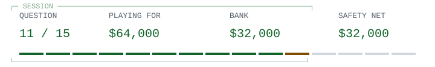

# Go / a compiler changes languages

<picture><source media="(prefers-color-scheme: dark)" srcset="hud/q11-dark.svg"><source media="(prefers-color-scheme: light)" srcset="hud/q11.svg"></picture>

**Safety net secured: $32,000**

> <picture><source media="(prefers-color-scheme: dark)" srcset="../../assets/trivia-question-dark.svg"><source media="(prefers-color-scheme: light)" srcset="../../assets/trivia-question.svg"></picture>
>
> **<samp>For Go 1.5, how did the main gc compiler make the transition from C to Go, according to the project&#39;s FAQ?</samp>**

<table width="100%">
<tr>
<td width="50%"><a href="game-over-32000.md"><picture><source media="(prefers-color-scheme: dark)" srcset="../../assets/trivia-a-dark.svg"><source media="(prefers-color-scheme: light)" srcset="../../assets/trivia-a.svg"></picture> <samp>It was rewritten from scratch using only the language specification</samp></a></td>
<td width="50%"><a href="q12.md"><picture><source media="(prefers-color-scheme: dark)" srcset="../../assets/trivia-b-dark.svg"><source media="(prefers-color-scheme: light)" srcset="../../assets/trivia-b.svg"></picture> <samp>Its C implementation was translated automatically into Go</samp></a></td>
</tr>
<tr>
<td width="50%"><a href="game-over-32000.md"><picture><source media="(prefers-color-scheme: dark)" srcset="../../assets/trivia-c-dark.svg"><source media="(prefers-color-scheme: light)" srcset="../../assets/trivia-c.svg"></picture> <samp>It was hand-translated into Go without automated translation</samp></a></td>
<td width="50%"><a href="game-over-32000.md"><picture><source media="(prefers-color-scheme: dark)" srcset="../../assets/trivia-d-dark.svg"><source media="(prefers-color-scheme: light)" srcset="../../assets/trivia-d.svg"></picture> <samp>It was replaced by the separate gccgo compiler</samp></a></td>
</tr>
</table>

<table width="100%">
<tr>
<td width="33%" valign="top">

<picture><source media="(prefers-color-scheme: dark)" srcset="../../assets/trivia-fifty-dark.svg"><source media="(prefers-color-scheme: light)" srcset="../../assets/trivia-fifty.svg"></picture>

<samp>B and D</samp>

</td>
<td width="34%" valign="top">

<picture><source media="(prefers-color-scheme: dark)" srcset="../../assets/trivia-hint-dark.svg"><source media="(prefers-color-scheme: light)" srcset="../../assets/trivia-hint.svg"></picture>

<samp>The transition used tooling to carry the existing implementation across.</samp>

</td>
<td width="33%" valign="top">

<picture><source media="(prefers-color-scheme: dark)" srcset="../../assets/trivia-cash-dark.svg"><source media="(prefers-color-scheme: light)" srcset="../../assets/trivia-cash.svg"></picture>

<samp>$32,000 / 10 of 15 answered.</samp>

<a href="../../README.md">Games</a> / <a href="q01.md">Restart</a>

</td>
</tr>
</table>

Previous answer

## Q10: A / A Case against the GO TO Statement

The University of Texas archive labels EWD215 'A Case against the GO TO Statement' and notes its publication under the better-known title in Communications of the ACM, March 1968, pages 147-148. The argument is about understanding a running process from static program text, not claiming that jumps are inherently slow. The archive also flags differences between the typescript and published version. Source: Dijkstra's EWD215, archived transcription.

[Source](https://www.cs.utexas.edu/~EWD/transcriptions/EWD02xx/EWD215.html)

<samp>[+] Prize ladder</samp>

| Round | Prize | Status |
| :--- | ---: | :--- |
| 15 | $1,000,000 | Next |
| 14 | $500,000 | Next |
| 13 | $250,000 | Next |
| 12 | $125,000 | Next |
| 11 | $64,000 | Current |
| 10 | $32,000 | Answered / Safety net |
| 9 | $16,000 | Answered |
| 8 | $8,000 | Answered |
| 7 | $4,000 | Answered |
| 6 | $2,000 | Answered |
| 5 | $1,000 | Answered / Safety net |
| 4 | $500 | Answered |
| 3 | $300 | Answered |
| 2 | $200 | Answered |
| 1 | $100 | Answered |

<samp>[+] Answer & source (spoiler)</samp>

## B / Its C implementation was translated automatically into Go

The Go FAQ says the gc compiler was originally written in C and, as of Go 1.5, translated automatically into Go. That is a bootstrapping milestone: a language's own tools can eventually be written in that language. It does not mean the first implementation was already self-hosted. Source: Go FAQ, 'What language is the compiler written in?'.

[Source](https://go.dev/doc/faq)

---

[Games](../../README.md) / [Restart](q01.md)
