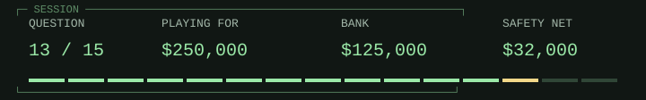

# C / dismantling a good story

<picture><source media="(prefers-color-scheme: dark)" srcset="hud/q13-dark.svg"><source media="(prefers-color-scheme: light)" srcset="hud/q13.svg"></picture>

> <picture><source media="(prefers-color-scheme: dark)" srcset="../../assets/trivia-question-dark.svg"><source media="(prefers-color-scheme: light)" srcset="../../assets/trivia-question.svg"></picture>
>
> **<samp>A popular story credits the PDP-11&#39;s addressing modes with inspiring C&#39;s ++ and --. What does Ritchie&#39;s history say undermines that explanation?</samp>**

<table width="100%">
<tr>
<td width="50%"><a href="game-over-32000.md"><picture><source media="(prefers-color-scheme: dark)" srcset="../../assets/trivia-a-dark.svg"><source media="(prefers-color-scheme: light)" srcset="../../assets/trivia-a.svg"></picture> <samp>C originally spelled both operators as words</samp></a></td>
<td width="50%"><a href="game-over-32000.md"><picture><source media="(prefers-color-scheme: dark)" srcset="../../assets/trivia-b-dark.svg"><source media="(prefers-color-scheme: light)" srcset="../../assets/trivia-b.svg"></picture> <samp>The PDP-11 had no increment instructions</samp></a></td>
</tr>
<tr>
<td width="50%"><a href="game-over-32000.md"><picture><source media="(prefers-color-scheme: dark)" srcset="../../assets/trivia-c-dark.svg"><source media="(prefers-color-scheme: light)" srcset="../../assets/trivia-c.svg"></picture> <samp>The operators were added after C was standardized</samp></a></td>
<td width="50%"><a href="q14.md"><picture><source media="(prefers-color-scheme: dark)" srcset="../../assets/trivia-d-dark.svg"><source media="(prefers-color-scheme: light)" srcset="../../assets/trivia-d.svg"></picture> <samp>The operators already existed in B before the PDP-11 existed</samp></a></td>
</tr>
</table>

<table width="100%">
<tr>
<td width="33%" valign="top">

<picture><source media="(prefers-color-scheme: dark)" srcset="../../assets/trivia-fifty-dark.svg"><source media="(prefers-color-scheme: light)" srcset="../../assets/trivia-fifty.svg"></picture>

<samp>B and D</samp>

</td>
<td width="34%" valign="top">

<picture><source media="(prefers-color-scheme: dark)" srcset="../../assets/trivia-hint-dark.svg"><source media="(prefers-color-scheme: light)" srcset="../../assets/trivia-hint.svg"></picture>

<samp>Check the chronology before matching language syntax to hardware instructions.</samp>

</td>
<td width="33%" valign="top">

<picture><source media="(prefers-color-scheme: dark)" srcset="../../assets/trivia-cash-dark.svg"><source media="(prefers-color-scheme: light)" srcset="../../assets/trivia-cash.svg"></picture>

<samp>$125,000 / 12 of 15 answered.</samp>

<a href="../../README.md">Games</a> / <a href="q01.md">Restart</a>

</td>
</tr>
</table>

Previous answer

## Q12: C / Only six scattered bits were left in a word for counts

McCarthy says car and cdr would not copy structures, so shared lists made erasure require reference counts. Only six bits remained, in separated parts of a word. The team chose a collector that marked accessible storage and reclaimed unmarked storage instead. This was a constraint of that representation, not a claim that reference counting never works. Source: McCarthy, History of Lisp, 'The implementation of LISP'.

[Source](https://www-formal.stanford.edu/jmc/history/lisp/node3.html)

<samp>[+] Prize ladder</samp>

| Round | Prize | Status |
| :--- | ---: | :--- |
| 15 | $1,000,000 | Next |
| 14 | $500,000 | Next |
| 13 | $250,000 | Current |
| 12 | $125,000 | Answered |
| 11 | $64,000 | Answered |
| 10 | $32,000 | Answered / Safety net |
| 9 | $16,000 | Answered |
| 8 | $8,000 | Answered |
| 7 | $4,000 | Answered |
| 6 | $2,000 | Answered |
| 5 | $1,000 | Answered / Safety net |
| 4 | $500 | Answered |
| 3 | $300 | Answered |
| 2 | $200 | Answered |
| 1 | $100 | Answered |

<samp>[+] Answer & source (spoiler)</samp>

## D / The operators already existed in B before the PDP-11 existed

Ritchie explicitly says ++ and -- appeared in B before the PDP-11. He discusses the PDP-7's auto-increment cells as a possible suggestion, while noting they were not used directly in implementing the operators, and points to compact translations as a likely stronger motivation. The evidence rejects the PDP-11 story without inventing a single certain replacement cause. Source: Ritchie, The Development of the C Language, 1993.

[Source](https://www.nokia.com/bell-labs/about/dennis-m-ritchie/chist.html)

---

[Games](../../README.md) / [Restart](q01.md)
