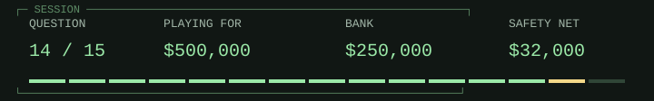

<!-- Run 02; question lisp-reference-count-bits. -->
# Lisp / hardware-shaped choices

<picture><source media="(prefers-color-scheme: dark)" srcset="hud/q14-dark.svg"><source media="(prefers-color-scheme: light)" srcset="hud/q14.svg"></picture>

> <picture><source media="(prefers-color-scheme: dark)" srcset="../../assets/trivia-question-dark.svg"><source media="(prefers-color-scheme: light)" srcset="../../assets/trivia-question.svg"></picture>
>
> **<samp>Why does McCarthy&#39;s Lisp history describe reference counting as infeasible without drastically changing its list representation?</samp>**

<table width="100%">
<tr>
<td width="50%"><a href="game-over-32000.md"><picture><source media="(prefers-color-scheme: dark)" srcset="../../assets/trivia-a-dark.svg"><source media="(prefers-color-scheme: light)" srcset="../../assets/trivia-a.svg"></picture> <samp>The machine could not add integers</samp></a></td>
<td width="50%"><a href="game-over-32000.md"><picture><source media="(prefers-color-scheme: dark)" srcset="../../assets/trivia-b-dark.svg"><source media="(prefers-color-scheme: light)" srcset="../../assets/trivia-b.svg"></picture> <samp>All lists were required to be immutable</samp></a></td>
</tr>
<tr>
<td width="50%"><a href="q15.md"><picture><source media="(prefers-color-scheme: dark)" srcset="../../assets/trivia-c-dark.svg"><source media="(prefers-color-scheme: light)" srcset="../../assets/trivia-c.svg"></picture> <samp>Only six scattered bits remained in a word for counts</samp></a></td>
<td width="50%"><a href="game-over-32000.md"><picture><source media="(prefers-color-scheme: dark)" srcset="../../assets/trivia-d-dark.svg"><source media="(prefers-color-scheme: light)" srcset="../../assets/trivia-d.svg"></picture> <samp>Objects were forbidden from sharing storage</samp></a></td>
</tr>
</table>

<table width="100%">
<tr>
<td width="33%" valign="top">

<picture><source media="(prefers-color-scheme: dark)" srcset="../../assets/trivia-fifty-dark.svg"><source media="(prefers-color-scheme: light)" srcset="../../assets/trivia-fifty.svg"></picture>

<samp>A and C</samp>

</td>
<td width="34%" valign="top">

<picture><source media="(prefers-color-scheme: dark)" srcset="../../assets/trivia-hint-dark.svg"><source media="(prefers-color-scheme: light)" srcset="../../assets/trivia-hint.svg"></picture>

<samp>The limitation was in the layout of a machine word.</samp>

</td>
<td width="33%" valign="top">

<picture><source media="(prefers-color-scheme: dark)" srcset="../../assets/trivia-cash-dark.svg"><source media="(prefers-color-scheme: light)" srcset="../../assets/trivia-cash.svg"></picture>

<samp>$250,000 / 13 of 15 answered.</samp>

<a href="../../README.md">Games</a> / <a href="q01.md">Restart</a>

</td>
</tr>
</table>

Previous answer

## Q13: A / To ease migration from B's context-dependent use of &

B gave & short-circuit meaning in truth-value contexts. When C introduced separate logical operators, preserving the old relative precedence eased conversion. Ritchie later regarded moving the precedence as preferable, but compatibility helped keep the rule.

[Source](https://www.nokia.com/bell-labs/about/dennis-m-ritchie/chist.html)

<samp>[+] Prize ladder</samp>

| Round | Prize | Status |
| :--- | ---: | :--- |
| 15 | $1,000,000 | Next |
| 14 | $500,000 | Current |
| 13 | $250,000 | Answered |
| 12 | $125,000 | Answered |
| 11 | $64,000 | Answered |
| 10 | $32,000 | Answered / Safety net |
| 9 | $16,000 | Answered |
| 8 | $8,000 | Answered |
| 7 | $4,000 | Answered |
| 6 | $2,000 | Answered |
| 5 | $1,000 | Answered / Safety net |
| 4 | $500 | Answered |
| 3 | $300 | Answered |
| 2 | $200 | Answered |
| 1 | $100 | Answered |

<samp>[+] Answer & source (spoiler)</samp>

## C / Only six scattered bits remained in a word for counts

McCarthy says shared list structures would require reference counts, but only six bits remained in separated parts of a word. The team instead marked accessible storage and reclaimed unmarked storage. This was a representation constraint, not a universal rejection of reference counting.

[Source](https://www-formal.stanford.edu/jmc/history/lisp/node3.html)

---

[Games](../../README.md) / [Restart](q01.md)
