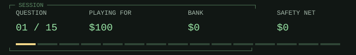

# Git / warm-up

> 
>
> **<samp>Which Git command reports staged changes, unstaged changes, and untracked files?</samp>**

<table width="100%">
<tr>
<td width="50%"><a href="game-over-0.md"> <samp>git log</samp></a></td>
<td width="50%"><a href="game-over-0.md"> <samp>git show</samp></a></td>
</tr>
<tr>
<td width="50%"><a href="q02.md"> <samp>git status</samp></a></td>
<td width="50%"><a href="game-over-0.md"> <samp>git branch</samp></a></td>
</tr>
</table>

<table width="100%">
<tr>
<td width="33%" valign="top">

<samp>A and C</samp>

</td>
<td width="34%" valign="top">

<samp>You want a working-tree report, not commit history.</samp>

</td>
<td width="33%" valign="top">

<samp>$0 / 0 of 15 answered.</samp>

<a href="../README.md">Games</a> / <a href="q01.md">Restart</a>

</td>
</tr>
</table>

<samp>[+] Prize ladder</samp>

| Round | Prize | Status |
| :--- | ---: | :--- |
| 15 | $1,000,000 | Next |
| 14 | $500,000 | Next |
| 13 | $250,000 | Next |
| 12 | $125,000 | Next |
| 11 | $64,000 | Next |
| 10 | $32,000 | Next / Safety net |
| 9 | $16,000 | Next |
| 8 | $8,000 | Next |
| 7 | $4,000 | Next |
| 6 | $2,000 | Next |
| 5 | $1,000 | Next / Safety net |
| 4 | $500 | Next |
| 3 | $300 | Next |
| 2 | $200 | Next |
| 1 | $100 | Current |

<samp>[+] Answer & source (spoiler)</samp>

## C / git status

git status reports the state of the working tree and index, including untracked files that are not ignored. git log shows history; git show inspects objects; git branch lists or manages branches.

[Source](https://git-scm.com/docs/git-status)

---

[Games](../README.md) / [Restart](q01.md)
