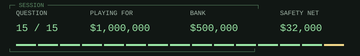

# Lock-free systems / final boss

> 
>
> **<samp>A thread reads shared value A. Other threads change it from A to B and back to A. Its later compare-and-swap expecting A succeeds. What is the ABA problem here?</samp>**

<table width="100%">
<tr>
<td width="50%"><a href="win.md"> <samp>Equality of the current value hides an intervening change that may invalidate the thread&#39;s assumptions</samp></a></td>
<td width="50%"><a href="game-over-32000.md"> <samp>Compare-and-swap is allowed to write B when its expected value is A</samp></a></td>
</tr>
<tr>
<td width="50%"><a href="game-over-32000.md"> <samp>An atomic operation necessarily exposes a partially written value</samp></a></td>
<td width="50%"><a href="game-over-32000.md"> <samp>Using sequential consistency guarantees that the problem cannot occur</samp></a></td>
</tr>
</table>

<table width="100%">
<tr>
<td width="33%" valign="top">

<samp>A and C</samp>

</td>
<td width="34%" valign="top">

<samp>Same value now does not mean same history, identity, or lifetime.</samp>

</td>
<td width="33%" valign="top">

<samp>$500,000 / 14 of 15 answered.</samp>

<a href="../README.md">Games</a> / <a href="q01.md">Restart</a>

</td>
</tr>
</table>

Previous answer

## Q14: C / All edge weights are non-negative

Non-negative edge weights support Dijkstra's greedy finalization argument; zero-weight edges are allowed. Negative edges can break that argument even without cycles. A DAG can instead use a topological-order shortest-path algorithm that allows negative weights.

[Source](https://www.boost.org/doc/libs/release/libs/graph/doc/dijkstra_shortest_paths.html)

<samp>[+] Prize ladder</samp>

| Round | Prize | Status |
| :--- | ---: | :--- |
| 15 | $1,000,000 | Current |
| 14 | $500,000 | Answered |
| 13 | $250,000 | Answered |
| 12 | $125,000 | Answered |
| 11 | $64,000 | Answered |
| 10 | $32,000 | Answered / Safety net |
| 9 | $16,000 | Answered |
| 8 | $8,000 | Answered |
| 7 | $4,000 | Answered |
| 6 | $2,000 | Answered |
| 5 | $1,000 | Answered / Safety net |
| 4 | $500 | Answered |
| 3 | $300 | Answered |
| 2 | $200 | Answered |
| 1 | $100 | Answered |

<samp>[+] Answer & source (spoiler)</samp>

## A / Equality of the current value hides an intervening change that may invalidate the thread's assumptions

Compare-and-swap checks the current value, not its history. A change away and back can invalidate assumptions even though the comparison succeeds. Version tags can detect changes when designed to avoid relevant wraparound; pointer-based structures may also need safe memory reclamation. Stronger memory ordering alone does not remove ABA.

[Source](https://en.wikipedia.org/wiki/ABA_problem)

---

[Games](../README.md) / [Restart](q01.md)
