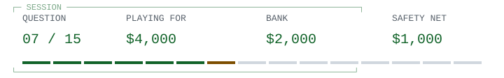

<!-- Run 03; question dijkstra-original-title. -->
# Dijkstra / before considered harmful

<picture><source media="(prefers-color-scheme: dark)" srcset="hud/q07-dark.svg"><source media="(prefers-color-scheme: light)" srcset="hud/q07.svg"></picture>

> <picture><source media="(prefers-color-scheme: dark)" srcset="../../../assets/trivia-question-dark.svg"><source media="(prefers-color-scheme: light)" srcset="../../../assets/trivia-question.svg"></picture>
>
> **<samp>What title appears on Dijkstra&#39;s archived original typescript of the publication famous as Go To Statement Considered Harmful?</samp>**

<table width="100%">
<tr>
<td width="50%"><a href="q08.md"><picture><source media="(prefers-color-scheme: dark)" srcset="../../../assets/trivia-a-dark.svg"><source media="(prefers-color-scheme: light)" srcset="../../../assets/trivia-a.svg"></picture> <samp>A Case against the GO TO Statement</samp></a></td>
<td width="50%"><a href="game-over-1000.md"><picture><source media="(prefers-color-scheme: dark)" srcset="../../../assets/trivia-b-dark.svg"><source media="(prefers-color-scheme: light)" srcset="../../../assets/trivia-b.svg"></picture> <samp>Notes on Structured Programming</samp></a></td>
</tr>
<tr>
<td width="50%"><a href="game-over-1000.md"><picture><source media="(prefers-color-scheme: dark)" srcset="../../../assets/trivia-c-dark.svg"><source media="(prefers-color-scheme: light)" srcset="../../../assets/trivia-c.svg"></picture> <samp>The Humble Programmer</samp></a></td>
<td width="50%"><a href="game-over-1000.md"><picture><source media="(prefers-color-scheme: dark)" srcset="../../../assets/trivia-d-dark.svg"><source media="(prefers-color-scheme: light)" srcset="../../../assets/trivia-d.svg"></picture> <samp>On the Reliability of Programs</samp></a></td>
</tr>
</table>

<table width="100%">
<tr>
<td width="33%" valign="top">

<picture><source media="(prefers-color-scheme: dark)" srcset="../../../assets/trivia-fifty-dark.svg"><source media="(prefers-color-scheme: light)" srcset="../../../assets/trivia-fifty.svg"></picture>

<samp>A and C</samp>

</td>
<td width="34%" valign="top">

<picture><source media="(prefers-color-scheme: dark)" srcset="../../../assets/trivia-hint-dark.svg"><source media="(prefers-color-scheme: light)" srcset="../../../assets/trivia-hint.svg"></picture>

<samp>The manuscript makes a case rather than using the later formula.</samp>

</td>
<td width="33%" valign="top">

<picture><source media="(prefers-color-scheme: dark)" srcset="../../../assets/trivia-cash-dark.svg"><source media="(prefers-color-scheme: light)" srcset="../../../assets/trivia-cash.svg"></picture>

<samp>$2,000 / 6 of 15 answered.</samp>

<a href="../../../README.md">Games</a> / <a href="q01.md">Restart</a>

</td>
</tr>
</table>

Previous answer

## Q6: D / No, a class can define a concrete type without inheritance

Stroustrup distinguishes concrete classes from hierarchy-based object-oriented programming. C++ classes can organize data and operations without any inheritance or virtual functions.

[Source](https://www.stroustrup.com/bs_faq.html)

<samp>[+] Prize ladder</samp>

| Round | Prize | Status |
| :--- | ---: | :--- |
| 15 | $1,000,000 | Next |
| 14 | $500,000 | Next |
| 13 | $250,000 | Next |
| 12 | $125,000 | Next |
| 11 | $64,000 | Next |
| 10 | $32,000 | Next / Safety net |
| 9 | $16,000 | Next |
| 8 | $8,000 | Next |
| 7 | $4,000 | Current |
| 6 | $2,000 | Answered |
| 5 | $1,000 | Answered / Safety net |
| 4 | $500 | Answered |
| 3 | $300 | Answered |
| 2 | $200 | Answered |
| 1 | $100 | Answered |

<samp>[+] Answer & source (spoiler)</samp>

## A / A Case against the GO TO Statement

The University of Texas archive labels EWD215 'A Case against the GO TO Statement' and identifies its publication under the better-known title. Its argument concerns understanding dynamic execution from static text, not the speed of jumps.

[Source](https://www.cs.utexas.edu/~EWD/transcriptions/EWD02xx/EWD215.html)

---

[Games](../../../README.md) / [Restart](q01.md)
