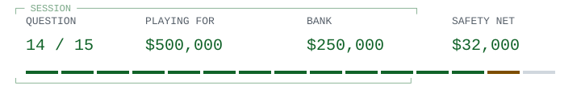

<!-- Run 03; question lamport-state-machines. -->
# Logical clocks / the bigger idea

<picture><source media="(prefers-color-scheme: dark)" srcset="hud/q14-dark.svg"><source media="(prefers-color-scheme: light)" srcset="hud/q14.svg"></picture>

> <picture><source media="(prefers-color-scheme: dark)" srcset="../../../assets/trivia-question-dark.svg"><source media="(prefers-color-scheme: light)" srcset="../../../assets/trivia-question.svg"></picture>
>
> **<samp>In his retrospective, what broader implementation idea does Lamport emphasize in Time, Clocks and the Ordering of Events?</samp>**

<table width="100%">
<tr>
<td width="50%"><a href="game-over-32000.md"><picture><source media="(prefers-color-scheme: dark)" srcset="../../../assets/trivia-a-dark.svg"><source media="(prefers-color-scheme: light)" srcset="../../../assets/trivia-a.svg"></picture> <samp>Eliminating all communication between replicas</samp></a></td>
<td width="50%"><a href="game-over-32000.md"><picture><source media="(prefers-color-scheme: dark)" srcset="../../../assets/trivia-b-dark.svg"><source media="(prefers-color-scheme: light)" srcset="../../../assets/trivia-b.svg"></picture> <samp>Proving physical clocks always show exactly the same time</samp></a></td>
</tr>
<tr>
<td width="50%"><a href="game-over-32000.md"><picture><source media="(prefers-color-scheme: dark)" srcset="../../../assets/trivia-c-dark.svg"><source media="(prefers-color-scheme: light)" srcset="../../../assets/trivia-c.svg"></picture> <samp>Replacing all distributed state with random sampling</samp></a></td>
<td width="50%"><a href="q15.md"><picture><source media="(prefers-color-scheme: dark)" srcset="../../../assets/trivia-d-dark.svg"><source media="(prefers-color-scheme: light)" srcset="../../../assets/trivia-d.svg"></picture> <samp>Implementing distributed state machines through a consistent ordering of requests</samp></a></td>
</tr>
</table>

<table width="100%">
<tr>
<td width="33%" valign="top">

<picture><source media="(prefers-color-scheme: dark)" srcset="../../../assets/trivia-fifty-dark.svg"><source media="(prefers-color-scheme: light)" srcset="../../../assets/trivia-fifty.svg"></picture>

<samp>B and D</samp>

</td>
<td width="34%" valign="top">

<picture><source media="(prefers-color-scheme: dark)" srcset="../../../assets/trivia-hint-dark.svg"><source media="(prefers-color-scheme: light)" srcset="../../../assets/trivia-hint.svg"></picture>

<samp>Think about replicas applying commands in an agreed order.</samp>

</td>
<td width="33%" valign="top">

<picture><source media="(prefers-color-scheme: dark)" srcset="../../../assets/trivia-cash-dark.svg"><source media="(prefers-color-scheme: light)" srcset="../../../assets/trivia-cash.svg"></picture>

<samp>$250,000 / 13 of 15 answered.</samp>

<a href="../../../README.md">Games</a> / <a href="q01.md">Restart</a>

</td>
</tr>
</table>

Previous answer

## Q13: A / Equality of the current value hides an intervening change that may invalidate the thread's assumptions

Ordinary compare-and-swap checks the current value, not its history. A change away and back can invalidate assumptions even though the comparison succeeds. Java's AtomicStampedReference demonstrates comparing both a reference and a stamp: updating the stamp on changes can detect this history, provided relevant wraparound is avoided. Pointer-based structures may also need safe memory reclamation. Stronger memory ordering alone does not remove ABA.

[Source](https://docs.oracle.com/en/java/javase/21/docs/api/java.base/java/util/concurrent/atomic/AtomicStampedReference.html)

<samp>[+] Prize ladder</samp>

| Round | Prize | Status |
| :--- | ---: | :--- |
| 15 | $1,000,000 | Next |
| 14 | $500,000 | Current |
| 13 | $250,000 | Answered |
| 12 | $125,000 | Answered |
| 11 | $64,000 | Answered |
| 10 | $32,000 | Answered / Safety net |
| 9 | $16,000 | Answered |
| 8 | $8,000 | Answered |
| 7 | $4,000 | Answered |
| 6 | $2,000 | Answered |
| 5 | $1,000 | Answered / Safety net |
| 4 | $500 | Answered |
| 3 | $300 | Answered |
| 2 | $200 | Answered |
| 1 | $100 | Answered |

<samp>[+] Answer & source (spoiler)</samp>

## D / Implementing distributed state machines through a consistent ordering of requests

Lamport says the ability to totally order requests led to implementing a sequential state machine across a network of processors. He emphasizes that the paper is about more than clocks or its mutual-exclusion example. The original algorithm's failure assumptions must not be confused with later fault-tolerant consensus protocols.

[Source](https://lamport.azurewebsites.net/pubs/pubs.html#time-clocks)

---

[Games](../../../README.md) / [Restart](q01.md)
