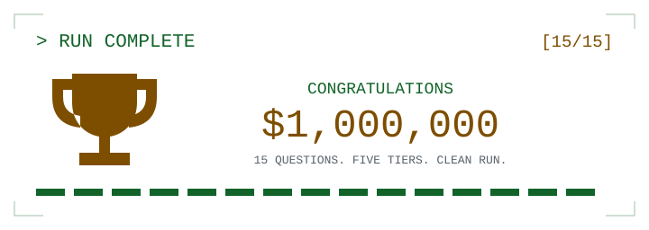

# Congratulations

<picture><source media="(prefers-color-scheme: dark)" srcset="../../../assets/trivia-victory-dark.svg"><source media="(prefers-color-scheme: light)" srcset="../../../assets/trivia-victory.svg"></picture>

**15 / 15. Final prize: $1,000,000**

All five difficulty tiers cleared. No more questions. Just bragging rights.

[Play again](q01.md) / [Choose another run](../../../README.md)

Final answer &amp; source

**C. Only six scattered bits remained in a word for counts**

McCarthy says shared list structures would require reference counts, but only six bits remained in separated parts of a word. The team instead marked accessible storage and reclaimed unmarked storage. This was a representation constraint, not a universal rejection of reference counting.

[Source](https://www-formal.stanford.edu/jmc/history/lisp/node3.html)

---

