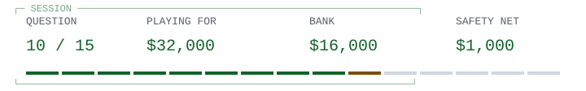

<!-- Run 05; question trusting-trust-bootstrap. -->
# Trusting Trust / a persistent compiler

<picture><source media="(prefers-color-scheme: dark)" srcset="hud/q10-dark.svg"><source media="(prefers-color-scheme: light)" srcset="hud/q10.svg"></picture>

> <picture><source media="(prefers-color-scheme: dark)" srcset="../../../assets/trivia-question-dark.svg"><source media="(prefers-color-scheme: light)" srcset="../../../assets/trivia-question.svg"></picture>
>
> **<samp>How does Thompson&#39;s attack survive rebuilding the compiler from source that no longer contains the attack?</samp>**

<table width="100%">
<tr>
<td width="50%"><a href="game-over-1000.md"><picture><source media="(prefers-color-scheme: dark)" srcset="../../../assets/trivia-a-dark.svg"><source media="(prefers-color-scheme: light)" srcset="../../../assets/trivia-a.svg"></picture> <samp>It relies on malicious instructions hidden in source comments</samp></a></td>
<td width="50%"><a href="game-over-1000.md"><picture><source media="(prefers-color-scheme: dark)" srcset="../../../assets/trivia-b-dark.svg"><source media="(prefers-color-scheme: light)" srcset="../../../assets/trivia-b.svg"></picture> <samp>It changes the processor&#39;s instruction set permanently</samp></a></td>
</tr>
<tr>
<td width="50%"><a href="q11.md"><picture><source media="(prefers-color-scheme: dark)" srcset="../../../assets/trivia-c-dark.svg"><source media="(prefers-color-scheme: light)" srcset="../../../assets/trivia-c.svg"></picture> <samp>The infected compiler recognizes compiler source and reinserts the attack into its successor</samp></a></td>
<td width="50%"><a href="game-over-1000.md"><picture><source media="(prefers-color-scheme: dark)" srcset="../../../assets/trivia-d-dark.svg"><source media="(prefers-color-scheme: light)" srcset="../../../assets/trivia-d.svg"></picture> <samp>Every clean compiler automatically downloads the original attack</samp></a></td>
</tr>
</table>

<table width="100%">
<tr>
<td width="33%" valign="top">

<picture><source media="(prefers-color-scheme: dark)" srcset="../../../assets/trivia-fifty-dark.svg"><source media="(prefers-color-scheme: light)" srcset="../../../assets/trivia-fifty.svg"></picture>

<samp>A and C</samp>

</td>
<td width="34%" valign="top">

<picture><source media="(prefers-color-scheme: dark)" srcset="../../../assets/trivia-hint-dark.svg"><source media="(prefers-color-scheme: light)" srcset="../../../assets/trivia-hint.svg"></picture>

<samp>The tool used to rebuild the tool is itself infected.</samp>

</td>
<td width="33%" valign="top">

<picture><source media="(prefers-color-scheme: dark)" srcset="../../../assets/trivia-cash-dark.svg"><source media="(prefers-color-scheme: light)" srcset="../../../assets/trivia-cash.svg"></picture>

<samp>$16,000 / 9 of 15 answered.</samp>

<a href="../../../README.md">Games</a> / <a href="q01.md">Restart</a>

</td>
</tr>
</table>

Previous answer

## Q9: B / Composing elaborate pieces of music

Lovelace conditionally suggests composing music if relationships of pitched sounds could be expressed and adapted to the engine's operations. This is not evidence of music actually being composed by the proposed machine.

[Source](https://www.fourmilab.ch/babbage/sketch.html#NoteA)

<samp>[+] Prize ladder</samp>

| Round | Prize | Status |
| :--- | ---: | :--- |
| 15 | $1,000,000 | Next |
| 14 | $500,000 | Next |
| 13 | $250,000 | Next |
| 12 | $125,000 | Next |
| 11 | $64,000 | Next |
| 10 | $32,000 | Current / Safety net |
| 9 | $16,000 | Answered |
| 8 | $8,000 | Answered |
| 7 | $4,000 | Answered |
| 6 | $2,000 | Answered |
| 5 | $1,000 | Answered / Safety net |
| 4 | $500 | Answered |
| 3 | $300 | Answered |
| 2 | $200 | Answered |
| 1 | $100 | Answered |

<samp>[+] Answer & source (spoiler)</samp>

## C / The infected compiler recognizes compiler source and reinserts the attack into its successor

Thompson describes a compiler that inserts a backdoor into login code and also reproduces the compiler modifications when compiling its own source. Removing the malicious source changes is insufficient if the rebuilding compiler binary remains compromised.

[Source](https://aeb.win.tue.nl/linux/hh/thompson/trust.html)

---

[Games](../../../README.md) / [Restart](q01.md)
